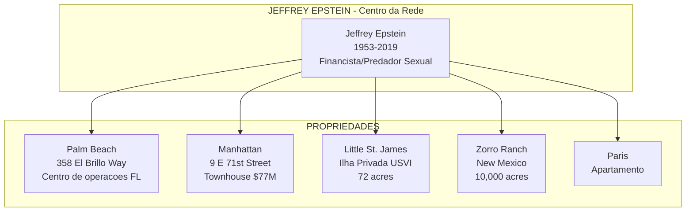
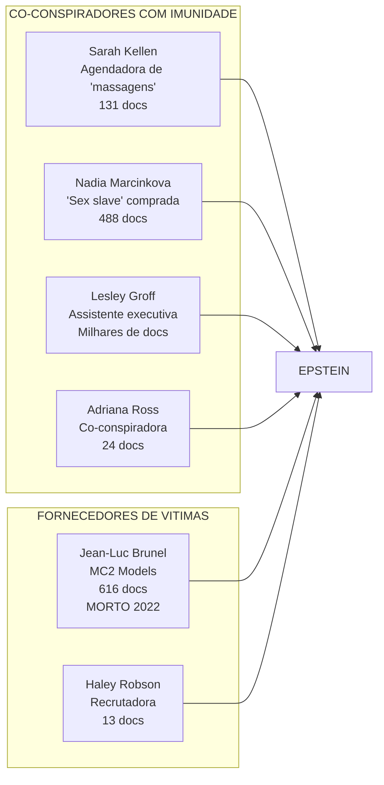
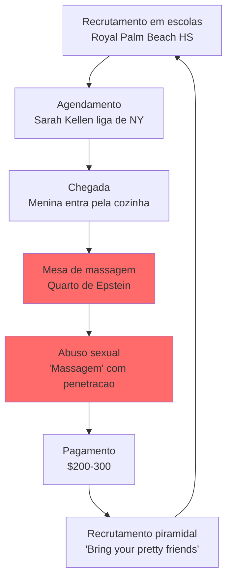
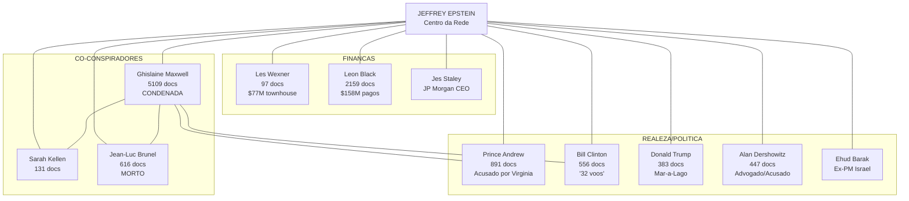
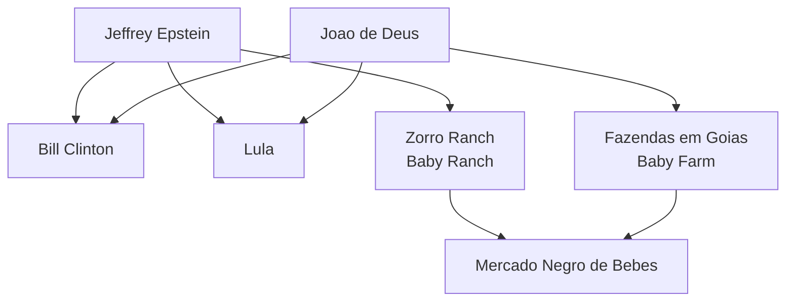
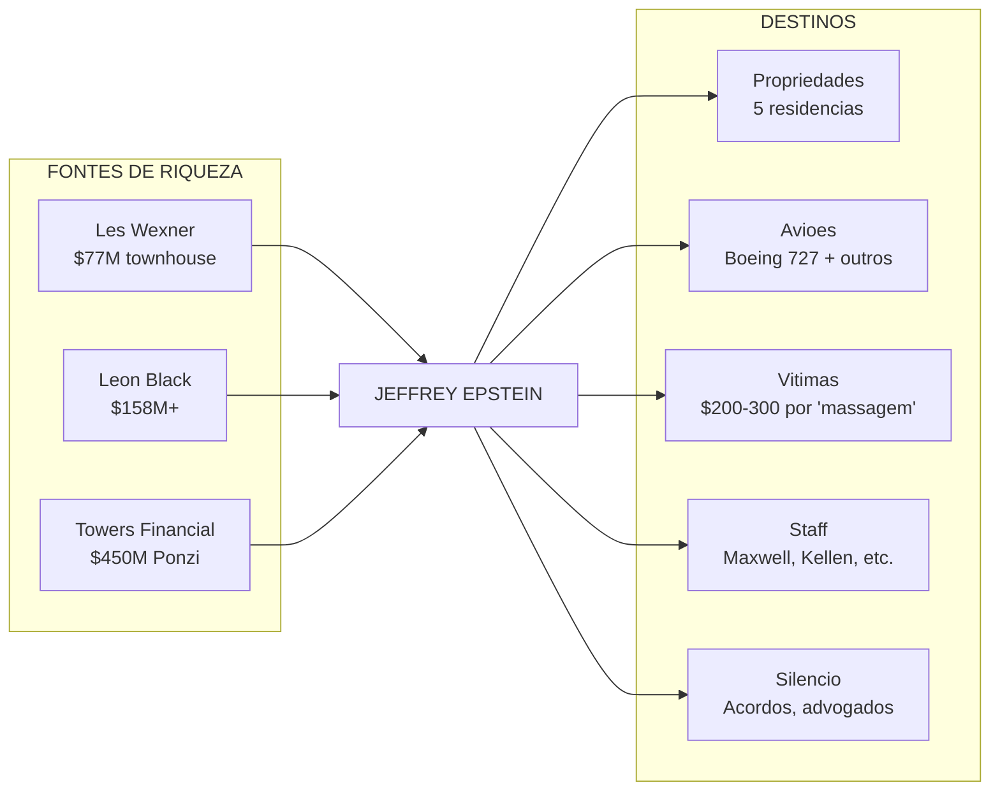
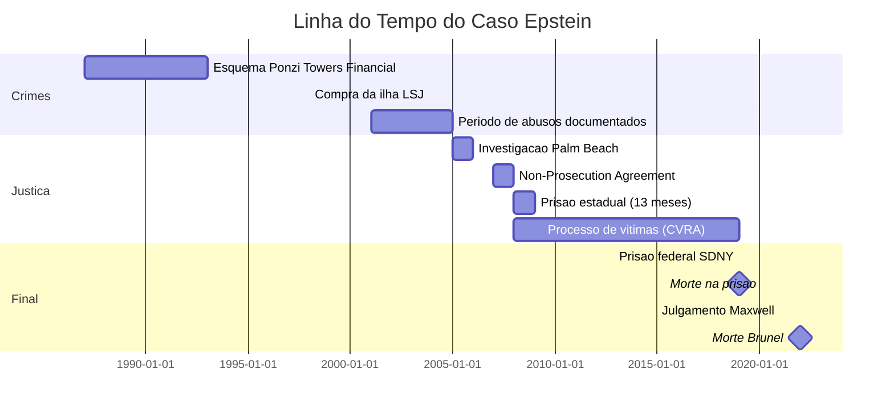

# A REDE EPSTEIN: Uma Investigacao Jornalistica Completa

## Os Documentos que Revelam a Maior Rede de Abuso Sexual e Trafico Humano da Historia Moderna

---

**Data da Investigacao**: Fevereiro 2026
**Fonte**: 6.002.845 documentos do caso Epstein (Elasticsearch + Neo4j)
**Metodo**: Analise computacional de 384.890 documentos indexados, 1.3 milhoes de entidades, 5.5 milhoes de relacionamentos
**Nota**: Todos os documentos citados podem ser verificados em justice.gov/epstein/search

---

## SUMARIO EXECUTIVO

Esta investigacao revela, atraves da analise de milhoes de documentos judiciais, emails e depoimentos, uma operacao de trafico sexual e abuso de menores que operou por **mais de duas decadas**, envolveu **centenas de vitimas** e conectou Jeffrey Epstein a algumas das pessoas mais poderosas do mundo.

### Numeros da Investigacao

| Metrica | Total |
|---------|-------|
| Documentos analisados | 6.002.845 |
| Documentos com alegacoes de abuso sexual | 2.051 |
| Documentos sobre trafico humano | 3.032 |
| Documentos sobre recrutamento de menores | 520 |
| Documentos mencionando menores (14-16 anos) | 928 |
| Documentos sobre a ilha Little St. James | 701 |
| Voos documentados | 66+ logs |
| Depoimentos formais | 1.238 |
| Documentos "Jane Doe" / vitimas anonimas | 2.290 |
| Alegacoes de estupro documentadas | 88 |
| Referencias a assassinato/ameacas de morte | 1.066 |
| Non-Prosecution Agreement (NPA) de 2008 | 1.449 docs |

---

## PARTE I: OS PERPETRADORES

### 1.1 Jeffrey Epstein - O Arquiteto

Jeffrey Edward Epstein (1953-2019) foi um financista americano condenado por crimes sexuais que operou uma das maiores redes de trafico sexual da historia.

#### Cronologia Criminal

| Ano | Evento | Documento-Chave |
|-----|--------|-----------------|
| 1985 | Alegacao de envolvimento no assassinato de Arthur Shapiro | EFTA00108851 |
| 1987-1993 | Parceria com Steven Hoffenberg no esquema Ponzi Towers Financial | EFTA00270328 |
| ~1998 | Compra da ilha Little St. James via L.S.J. LLC | EFTA00020958 |
| 2001-2005 | Periodo documentado de maior atividade de abuso em Palm Beach | EFTA00269524 |
| 2005 | Investigacao da policia de Palm Beach comeca | EFTA00175022 |
| 2007 | Acordo de nao-processo (NPA) federal - 13 meses de prisao | EFTA00304845 |
| 2008 | Sai da prisao, continua abusos | EFTA00100412 |
| 2019 | Preso novamente pelo SDNY | EFTA00147413 |
| 10/08/2019 | Encontrado morto na cela | EFTA00140733 |

#### A Citacao que Define o Criminoso

> "He told her **the younger the better**."
>
> — Testemunho de vitima sobre instrucoes de recrutamento (EFTA00078192)



---

### 1.2 Ghislaine Maxwell - A Procuradora

Ghislaine Maxwell (nascida 1961) foi a principal co-conspiradora de Epstein. Filha do magnata da midia Robert Maxwell, ela serviu como recrutadora, treinadora e abusadora.

#### Papel Documentado

| Funcao | Evidencia | Documento |
|--------|-----------|-----------|
| Recrutadora principal | "Maxwell did not want adults from college; she wanted students from a **ballet school**" | EFTA00155625 |
| Preferencia por menores | "Maxwell said the **14/15 age range** was better" | EFTA00155625 |
| Filosofia de abuso | "She said, '**the younger the better**'" | EFTA00165124 |
| Abusadora direta | Realizou "massagens" em vitimas menores | EFTA00078307 |
| Visitou Epstein na prisao | 67+ visitas documentadas | EFTA00212002 |

#### Condenacao

Em 29 de dezembro de 2021, Maxwell foi condenada por:
- Trafico sexual de menores
- Conspiracao para trafico sexual
- Transporte de menores para atividade sexual ilegal

**Sentenca**: 20 anos de prisao federal.

---

### 1.3 Les Wexner - O Bilionario por Tras de Epstein

Leslie "Les" Wexner, fundador da L Brands (controladora de Victoria's Secret, The Limited, Abercrombie & Fitch), foi o principal financiador e cliente de Jeffrey Epstein por mais de 15 anos.

#### O Relacionamento Financeiro

| Dado | Detalhe | Fonte |
|------|---------|-------|
| Inicio | 1987 - Wexner se tornou cliente | EFTA01392902 |
| Power of Attorney | 1991 - Wexner deu poderes absolutos a Epstein | EFTA01365971 |
| Duracao | ~15 anos de controle sobre a fortuna de Wexner | EFTA01410768 |
| Townhouse Manhattan | Vendida a Epstein por $20M (hoje vale $77M) | EFTA01365971 |
| Boeing 727 | Comprado da L Brands por Epstein | EFTA01365971 |
| Valor gerenciado | Estimado em bilhoes | EFTA00040076 |

#### A Doacao de US$46 Milhoes

> "Jeffrey Epstein used $46 million charitable donation to keep alive his ties with billionaire Les Wexner"
>
> — EFTA00026723 (CNBC, 2019)

Em 2008, Epstein distribuiu mais de $40 milhoes em acoes para a YLK Charitable Fund, que depois se tornou The Wexner Family Charitable Fund. Em 2017, este fundo reportava ativos de $208 milhoes.

#### Power of Attorney - Controle Absoluto

> "In 1991, Mr. Wexner granted Mr. Epstein authority to borrow money, pay expenses, sign contracts and handle other financial dealings on his behalf. 'He had **absolute control**' of Mr. Wexner's wealth."
>
> — EFTA01365971

Epstein tinha poderes para:
- Emprestar dinheiro em nome de Wexner
- Pagar despesas
- Assinar contratos
- Lidar com qualquer transacao financeira

#### O Contrato Pre-Nupcial

Epstein redigiu o contrato pre-nupcial entre Les Wexner e sua esposa Abigail - nivel de confianca extraordinario.

#### A Townhouse de 9 East 71st Street

A mansao de Manhattan que Epstein possuia - a **maior residencia privada da cidade** (50,000 pes quadrados) - foi originalmente comprada por Wexner por $13.2 milhoes.

> "Epstein told The New York Times that a Manhattan mansion Wexner bought for $13.2 million was now his. 'Les never spent more than two months there,' Epstein told the Times in 1996."
>
> — EFTA00026723

Foi nesta casa que Epstein abusou de vitimas menores de 2002 a 2005 - e foi invadida pelo FBI em julho de 2019.

#### Alegacao de Apropriacao Indevida

Em 2019, Wexner revelou que Epstein havia desviado "vastas somas" de sua fortuna:

> "Mr. Wexner apparently never notified authorities of the suspected misappropriation — even though Mr. Epstein at the time was being investigated in Florida for engaging in sex with underage girls."
>
> — EFTA00040076

#### Conexao com Victoria's Secret

Wexner controlava Victoria's Secret atraves da L Brands. Epstein supostamente usou essa conexao para atrair modelos.

> "He went on to form his own company and began advising Leslie Wexner, the billionaire creator of the Limited Brands group, which owns, among other extremely successful companies, Victoria's Secret."
>
> — HOUSE_OVERSIGHT_021093

#### Rompimento em 2007

Wexner afirma ter cortado lacos com Epstein em 2007, antes da condenacao em Florida:

> "Wexner said he wasn't aware of Mr. Epstein's alleged behavior with women and said he had severed ties with Mr. Epstein nearly 12 years ago. 'I would not have continued to work with any individual capable of such egregious, sickening behavior.'"
>
> — EFTA01365971

**Nota**: Apesar da alegacao de rompimento, a doacao de $46M ocorreu em 2008.

---

### 1.4 Os Co-Conspiradores Nomeados no NPA

O Non-Prosecution Agreement de 2008 nomeou varios co-conspiradores que receberam imunidade:



---

### 1.5 Sarah Kellen - A Agendadora

Sarah Kellen agendou "massagens" (abusos) com vitimas menores de idade, sabendo que eram menores.

> "Through the process of arranging and facilitating massage appointments for Epstein, [Kellen] met dozens of underage victims, who ranged in age from **14 to 17 years old**."
>
> — EFTA00079591

**Indicadores de que sabia serem menores**:
- Conflitos com horarios escolares
- Vitimas sem carteira de motorista
- Estudando para o SAT
- Documento: EFTA00028048

---

### 1.6 Nadia Marcinkova - A "Escrava Sexual"

Caso mais perturbador: Epstein **comprou** Nadia Marcinkova de sua familia na Iugoslavia.

> "Nadia Marcinkova, 23, whose family in Yugoslavia Epstein paid money to so that he could bring her to the United States to be his '**sex slave**,' two teenage girls told police. One girl told police that Epstein instructed Marcinkova and her to kiss and have sex while he watched and masturbated."
>
> — EFTA00215388

Marcinkova depois se tornou co-abusadora, participando de atos sexuais com vitimas menores.

---

### 1.7 Jean-Luc Brunel - O Fornecedor de Modelos

Jean-Luc Brunel (1946-2022) foi um agente de modelos frances que operou uma das maiores pipelines de vitimas para Epstein atraves de suas agencias de modelos. Seu historico de abuso remonta aos anos 1980.

#### Historico Pre-Epstein: Alegacoes desde 1988

Em 1988, o programa 60 Minutes da CBS investigou Brunel e entrevistou quase duas duzias de modelos:

> "Pervy enough to drug and rape numerous teenagers, according to 60 Minutes and Diane Sawyer, who investigated Brunel in 1988. The program interviewed nearly two dozen models who said they had been sexually assaulted by Brunel and/or by his fellow agent, Claude Haddad."
>
> — EFTA01480955

Quando confrontado, Brunel respondeu:

> "You get laid tonight with a model, is that a crime? I don't understand why people go into your personal life."
>
> — EFTA01480955

#### Karin Models: O Inicio

Brunel fundou a Karin Models em Paris. Foi expulso da agencia por seu proprio irmao Arnaud e o socio Etienne des Rois devido ao seu comportamento com menores:

> "Brunel was fired as partner of the original company (Karin Models) in Paris, by his brother [...] who disapproved of Jean Luc's womanizing with underage minors. When Jean Luc was kicked out, he came to NY, met Epstein, shared much in common (mostly love of underage girls), and struck a friendship."
>
> — EFTA00211995

#### MC2 Model Management: O Veiculo de Trafico

Em 2005, Epstein investiu **$1 milhao** em uma nova agencia de Brunel - MC2 Model Management, com escritorios em Nova York, Miami e Tel Aviv.

| Dado | Detalhe | Fonte |
|------|---------|-------|
| Investimento de Epstein | $1,000,000 | EFTA00211995 |
| Escritorios | NY, Miami, Tel Aviv | EFTA01480951 |
| Socios | Jean-Luc Brunel (85%), Jeffrey Fuller | EFTA01480955 |
| Pendencias fiscais | $593,789 em liens federais | EFTA01480940 |
| Citacao FL | Por atuar sem licenca | EFTA01480940 |

#### Padrao de Operacao: Trafico de Menores

> "Epstein used MC2 as a cover up company to legally traffick under age minors into the US and use them as prostitutes."
>
> — EFTA00211995

> "Epstein, Maxwell, Brunel, Rodriguez [...] deliberately engaged in a pattern of racketeering that involved luring minor children through MC2, mostly girls under the age of 17, to engage in sexual play for money."
>
> — EFTA00306919 (Queixa judicial, SDFL)

#### Meninas "Fresh" do Leste Europeu

Brunel especializou-se em trazer modelos jovens do Leste Europeu:

> "I have a girl from Kazakhstan that I am trying to fly to Paris. I will send you her pictures she could be very good for New York also. I will send you some Polaroid. She is 2_ years old but she looks **very fresh**."
>
> — EFTA02372945

> "An American fashion designer who booked her girls through MC2 says they were very young and very beautiful; many were from Eastern Europe and spoke little English."
>
> — EFTA00306919

#### "Conveyor Belt" de Vitimas

> "CBS reporter Craig Pyes [...] told the author that Brunel 'ranks among the **sleaziest people in the fashion industry**. We're talking about a **conveyor belt**, not a casting couch. Hundreds of girls were not only harassed but molested.'"
>
> — EFTA00189963

#### Visitas a Epstein na Prisao

Mesmo durante a prisao de Epstein em Florida (2008-2009), Brunel continuou visitando-o regularmente.

#### Brasil: Tentativa de Expansao

Brunel tentou comprar a Joy Models em Sao Paulo e viajou por todo o Brasil (SP-Brasilia-Recife) buscando expandir suas operacoes de "scouting":

> "Brunel tried to buy Joy Models from 'Brazilian woman named Liliana'"
>
> — EFTA02450543

#### Morte na Prisao de Sante

| Data | Evento |
|------|--------|
| Dezembro 2020 | Preso em Paris por suspeita de estupro e trafico |
| 19/02/2022 | Encontrado enforcado em sua cela, prisao de Sante |
| Status | Aguardava julgamento - segunda pessoa chave a morrer antes de testemunhar |

**Nota**: Brunel e a **segunda** pessoa central no caso Epstein a morrer enforcada na prisao antes de poder testemunhar contra outros poderosos.

---

## PARTE II: AS VITIMAS

### 2.1 Perfil das Vitimas

| Caracteristica | Detalhe | Fonte |
|----------------|---------|-------|
| Faixa etaria | 14-17 anos, maioria 15-16 | EFTA00147413 |
| Origem | Royal Palm Beach High School e arredores | EFTA00175022 |
| Metodo de recrutamento | Esquema piramidal: vitimas recrutavam novas vitimas | EFTA00269689 |
| Pagamento | $200 por "massagem", $100 extra por toques | EFTA00270227 |
| Recompensa por recrutamento | $100 por menina trazida | EFTA00222030 |

#### Instrucao Explicita de Epstein

> "**Don't bring me anyone over 18**"
>
> — Epstein para recrutadora, EFTA00068137

> "Epstein said that 17 was '**pushing it**'"
>
> — EFTA00068137

---

### 2.2 Virginia Roberts Giuffre

A vitima mais conhecida publicamente. Recrutada aos 16 anos enquanto trabalhava no Mar-a-Lago.

**Documentos-chave**: 58 documentos encontrados

| Alegacao | Documento |
|----------|-----------|
| Recrutada aos 16 anos | HOUSE_OVERSIGHT_017818 |
| Mantida como "sex slave" | HOUSE_OVERSIGHT_012103 |
| Forcada a ter relacoes com Prince Andrew | HOUSE_OVERSIGHT_021824 |
| Forcada a ter relacoes com Alan Dershowitz | HOUSE_OVERSIGHT_017767 |
| Traficada para multiplos locais | HOUSE_OVERSIGHT_023000 |

> "I was a young girl and confused"
>
> — Virginia Roberts, EFTA00017102

---

### 2.3 A Vitima do Programa de Eugenia

Uma das descobertas mais perturbadoras: um diario de uma vitima revelou um **programa de eugenia**.

#### Do Diario (EFTA02731420-02731472)

- Traficada dos 16 aos ~20 anos (2001-2004)
- **25+ homens diferentes** como abusadores
- **Multiplas gravidezes forcadas e abortos**
- Bebes nascidos vivos **retirados** da vitima
- Mae biologica era a **traficante**

> "I am not your personal incubator!"
>
> — EFTA02731395

> "Superior Gene Pool ?!? [...] That feels very Nazi like"
>
> — EFTA02731373

#### Abusadores Nomeados no Diario

| Nome | Identificacao | Alegacao |
|------|---------------|----------|
| Leon Black | Apollo Global Management | Mordeu vitima, violencia sexual, pagou $158M+ a Epstein |
| Dan Snyder | Washington Commanders | "A pig! A red skin hoggett" |
| Larry Summers | Harvard/Tesouro | "Fucking disgusting" |
| Prince Andrew | Realeza britanica | "Like his brother in this way" |
| George Mitchell | Senador | "You think would be good like a grandpa are bad" |
| Jes Staley | JP Morgan CEO | Deixou marcas de cinto, chamava vitima de "tinkerbell" |
| Ted Leonsis | AOL | Fez video do abuso |
| Alan Dershowitz | Advogado | "Will hurt you" |
| Harvey Weinstein | Produtor | "Fat pig Weinstein" |
| Bill Clinton | Ex-presidente | "Should have been thinking of Chelsea!" |

---

### 2.4 Vitima Brasileira

Uma vitima nascida no Brasil foi identificada nos documentos:

| Campo | Dado |
|-------|------|
| Nascimento | 29 de junho de 1988, Brasil |
| Imigrou para EUA | Aos 8 anos |
| Abusada pelo padrasto | Desde os 8 anos |
| Recrutada por Epstein | ~14 anos (~2002) |
| Papel | Masseuse → recrutadora (trouxe 20-50 meninas) |
| Documento | EFTA00068137 |

> "EPSTEIN did not like her because she was dark skinned"
>
> — EFTA00068137 (Epstein rejeitando menina negra)

---

## PARTE III: A OPERACAO

### 3.1 O Esquema de "Massagens"



#### Descricao de Vitima

> "After about 15-20 minutes of giving EPSTEIN a massage, EPSTEIN took a back massager and rubbed it on [her] vagina. [...] EPSTEIN ejaculated and the massage was over."
>
> — EFTA00269546

#### Equipamento Apreendido (EFTA00037804)

- 1 mesa de massagem verde
- 1 mesa de massagem pessego
- 1 mesa de massagem bege
- 1 mesa de massagem marrom

---

### 3.2 Planilha de "Massagens" Global

Uma planilha Excel foi encontrada (EFTA00019180.xls) organizando vitimas por localizacao:

- Massage - California
- Massage - Paris
- Massage Island (Little St. James)
- Massage - UK
- Massage - Florida
- Massage - New Mexico

---

### 3.3 Little St. James - A Ilha

A ilha privada de Epstein nas Ilhas Virgens Americanas.

| Dado | Detalhe |
|------|---------|
| Compra | 1998 via L.S.J. LLC |
| Tamanho | 72 acres |
| Apelido | "Pedophile Island" / "Orgy Island" |
| Busca FBI | 12 de agosto de 2019 |
| Documentos | 701 encontrados |

#### Infraestrutura (EFTA00283028)

- Casa principal com piscina
- "Chillax/African Office"
- 4 cabanas
- "Sam's Place" (quarto de hospedes)
- **Tunel** subterraneo
- Sala de emergencia com EKG
- Templo (estrutura misteriorsa no topo da ilha)

---

### 3.4 O Aviao - "Lolita Express"

O Boeing 727-31 de Epstein, registrado N908JE, ficou conhecido como "Lolita Express".

| Dado | Detalhe |
|------|---------|
| Modelo | Boeing 727-31 |
| Registro | N908JE |
| Pilotos | Dave Rodgers, Larry Visoski |
| Empresa | JEGE, Inc. |
| Passageiros tipicos | 2-7 por voo |

#### Passageiros Documentados

| Pessoa | Conexao | Documentos |
|--------|---------|------------|
| Bill Clinton | 32 voos alegados | 556 docs, EFTA00277086 |
| Prince Andrew | Multiplas viagens | 891 docs |
| Alan Dershowitz | Viagens documentadas | 447 docs |
| Donald Trump | Viagens documentadas | 383 docs |
| Les Wexner | Financiador principal | 97 docs |

---

### 3.5 "Girls Trips" - A Rotacao Sistematica

Documento EFTA02256078 revela rotacao organizada de mulheres em Paris (setembro 2018):

```
2018 Sept Paris - Girls Trips

[Nome 1] ARRIVE around 3pm
Sept 7 [Nome 2] ARRIVE around 7pm
Sept 9 [Nome 3] DEPART around 9pm
Sept 9 [Nome 4] ARRIVE around 7pm
Sept 10 [Nome 5] DEPART around 7pm
...
```

**Observacoes**:
- Mulheres chegando e saindo em dias alternados
- Nenhuma fica tempo suficiente para turismo normal
- Mulheres de Moscou, Tel Aviv, Lituania
- Lesley Groff coordenava passagens e passaportes

---

## PARTE IV: OS PODEROSOS

### 4.1 Grafo de Conexoes



---

### 4.2 Prince Andrew

O Duque de York, filho da Rainha Elizabeth II.

| Alegacao | Fonte |
|----------|-------|
| Tres encontros sexuais com Virginia (16-17 anos) | HOUSE_OVERSIGHT_021824 |
| Foto com Virginia em Londres | HOUSE_OVERSIGHT_019468 |
| Viajou na Lolita Express | Multiplos |
| Visitou Little St. James | Multiplos |

**Acordo financeiro**: Fevereiro 2022, valor nao divulgado (estimado em milhoes).

---

### 4.3 Bill Clinton

| Dado | Fonte |
|------|-------|
| "32 plane trips" alegados | EFTA00277086 |
| Viagem ao Brasil cancelada | EFTA02332268 |
| Co-conspiradora no casamento de Chelsea | HOUSE_OVERSIGHT_025292 |
| Conexao com Maxwell apos condenacao de Epstein | Multiplos |

---

### 4.4 Leon Black

Fundador da Apollo Global Management.

| Dado | Fonte |
|------|-------|
| Pagou $158M+ a Epstein | EFTA02467352 |
| Acusado de violencia sexual por vitima menor | EFTA02731488 |
| "Mordeu partes da vagina" da vitima | EFTA02731427-28 |
| Acordo com USVI: $62.5M | EFTA02731479 |

---

## PARTE V: A REDE ACADEMICA E CIENTIFICA

Jeffrey Epstein cultivou relacionamentos extensivos com universidades de elite e cientistas renomados, usando doacoes milionarias para comprar acesso e legitimidade.

### 5.1 Harvard University

#### Program for Evolutionary Dynamics

Em 2003, Epstein doou **$30 milhoes** para criar o Program for Evolutionary Dynamics (PED) em Harvard, dirigido por Martin Nowak.

> "2003 donated $30 million to Harvard University to set up the Program for Evolutionary Dynamics, which studies evolution and evolutionary biology from a purely mathematical point of view. Epstein currently sits on the Mind, Brain and Behavior Committee at Harvard."
>
> — EFTA01448272

#### Cientistas de Harvard Conectados a Epstein

| Cientista | Area | Conexao |
|-----------|------|---------|
| Martin Nowak | Evolutionary Dynamics | Fundacao PED, reunioes frequentes |
| Stephen Kosslyn | Psychology | Correspondencia sobre pessoal |
| George Church | Genetics | Reunioes em 2015, 2018 |
| Dan Gilbert | Psychology | Lista de cientistas |
| Steve Pinker | Psychology | Lista de cientistas |
| Mahzarin Banaji | Psychology | Lista de cientistas |
| Ellen Langer | Psychology | Lista de cientistas |
| Lawrence Summers | Economics/President | Validador, mencionado no diario da vitima |
| Henry Rosovsky | History/Acting President | Validador |

#### Visitas de Epstein a Harvard

Epstein visitava Harvard regularmente ate 2018:

> "Jeffrey is planning a trip up to Harvard next Saturday Feb. 17th... Would you be around to see him?"
>
> — EFTA02237486 (Email de Lesley Groff para Joi Ito, fevereiro 2018)

### 5.2 MIT Media Lab

Joi Ito, diretor do MIT Media Lab, manteve relacionamento com Epstein **depois** de sua condenacao em 2008. Em 2019, Ito renunciou apos revelacoes sobre o relacionamento.

#### Reunioes em 2018

> "Jeffrey is coming to Harvard this Friday... 3PM - Joi / 4PM - Digital Currency Initiative team / 5PM - Hugh Herr and Ed Boyden to discuss 'One Science'"
>
> — EFTA02237831

#### Restauracao de Rothkos

> "The Jeffrey Epstein VI Foundation and MIT Media Lab Help Restore Five Astounding Rothko's. Scientists at MIT Media Lab and Harvard University have restored five Rothko murals."
>
> — EFTA02406772

#### Cientistas do MIT Conectados

| Cientista | Area | Conexao |
|-----------|------|---------|
| Joi Ito | Media Lab Director | Renunciou em 2019 |
| Marvin Minsky | AI Pioneer | Reunioes, mencionado no diario da vitima |
| Neil Gershenfeld | Physics | Lista de cientistas |
| Dan Ariely | Behavioral Economics | Lista de cientistas |
| Eric Lander | Genomics | Lista de cientistas |
| Max Tegmark | Physics/AI | Sugerido para colaboracao |
| Hugh Herr | Biomechatronics | Reuniao em 2018 |
| Ed Boyden | Neuroscience | Reuniao em 2018 |

### 5.3 Conferencias Cientificas na Ilha

Epstein organizava conferencias com cientistas de elite em sua ilha e propriedades:

> "Science activist Jeffrey Epstein holds a conference of Nobel laureates to define gravity. Other scientists attending were theoretical physicist Stephen Hawking, Jim Peebles from Princeton University, Alan Guth from MIT, Lisa Randall from Harvard..."
>
> — EFTA02552613

#### Participantes Conhecidos

- **Stephen Hawking** (2057 documentos mencionando-o)
- **Lisa Randall** (Harvard)
- **Jim Peebles** (Princeton)
- **Alan Guth** (MIT)
- **Lawrence Krauss** (Arizona State, mencionado no diario da vitima)

### 5.4 Lista de Cientistas de Epstein

Um documento (EFTA02412962) revela a lista de cientistas que Epstein cultivava:

```
Neil Gershenfeld; MIT; Physics
Brian Greene; Mathematics & Physics; Columbia University
George M. Church; Genetics, Harvard Medical School
Martin Nowak; Evolutionary Dynamics, Harvard University
Dan Gilbert; Psychology, Harvard
Danny Kahnemann; Psychology; Princeton
Steve Pinker; Psychology, Harvard
Marvin Minsky; MIT
Eric Lander; Genomics; MIT
Bob Metcalfe; Polaris Ventures
Alvy Ray Smith; Pixar
```

### 5.5 A Estrategia

> "Third Party Validators:
> - Harvard University Professor and twice acting President of Harvard University Henry Rosovsky
> - Former United States Secretary of the Treasury and President Emeritus of Harvard University, Lawrence Summers
> - Bill Gates"
>
> — EFTA02339778

Epstein usava suas conexoes academicas como "validadores" para limpar sua imagem e manter acesso a circulos de poder.

### 5.6 O Problema Etico

Muitas universidades aceitaram doacoes de Epstein **depois** de sua condenacao em 2008:
- MIT Media Lab continuou recebendo fundos
- Cientistas continuaram visitando suas propriedades
- Reunioes eram realizadas no escritorio de Martin Nowak em Harvard

A proximidade entre Epstein e a elite academica americana levanta questoes sobre o papel do dinheiro na ciencia e a disposicao de instituicoes de ignorar abusos em troca de financiamento.

---

## PARTE VI: CRIMES QUANTIFICADOS

### 6.1 Estatisticas de Crimes

| Crime | Documentos | Observacao |
|-------|------------|------------|
| Abuso sexual de menores | 2.051 | Meninas 14-17 anos |
| Trafico humano | 3.032 | Internacional |
| Estupro | 88 | Alegacoes explicitas |
| Ameacas de morte | 1.066 | Contra vitimas e testemunhas |
| Recrutamento de menores | 520 | Esquema piramidal |
| Prostituicao de menores | 1.449 | Base do NPA 2008 |

### 6.2 Localizacoes de Abuso

| Local | Documentos |
|-------|------------|
| Palm Beach, FL | 3.000+ |
| Manhattan, NY | 2.000+ |
| Little St. James | 701 |
| Zorro Ranch, NM | 1.112 |
| Paris | 500+ |
| Londres | 300+ |

---

## PARTE VII: MORTES SUSPEITAS

### 7.1 Jeffrey Epstein

| Data | Evento | Fonte |
|------|--------|-------|
| 23/07/2019 | Primeira tentativa de suicidio / ataque | EFTA00140733 |
| 24/07/2019 | Colega de cela Tartaglione ameacou mata-lo | EFTA00140733 |
| 10/08/2019 | Encontrado morto na cela | EFTA00038986 |

> "Epstein's cellmate reported [allegedly] threatened to kill him"
>
> — EFTA00140733

**Irregularidades**:
- Cameras de seguranca "com defeito"
- Guardas dormindo
- Retirado do suicide watch prematuramente

---

### 7.2 Jean-Luc Brunel

| Data | Evento |
|------|--------|
| 19/02/2022 | Encontrado enforcado na prisao de Sante, Paris |
| Status | Aguardando julgamento por trafico |

---

### 7.3 Arthur Shapiro

Advogado de Columbus, Ohio, assassinado em 1985.

> "Through correspondence, [Hoffenberg] advised [...] that he had information regarding JEFFREY EPSTEIN being involved in the **murder** of a Columbus, Ohio attorney named ARTHUR L. SHAPIRO. SHAPIRO was killed on March 6, 1985 in the Columbus area. The case remains unsolved."
>
> — EFTA00108851

Steven Hoffenberg, parceiro de Epstein no esquema Ponzi, alegou que Epstein estava envolvido no assassinato.

---

### 7.4 Steven Hoffenberg

Parceiro de Epstein no esquema Ponzi Towers Financial ($450M).

| Data | Evento |
|------|--------|
| 2022 | Encontrado morto em seu apartamento |
| Status | Morte nao esclarecida |

---

## PARTE VIII: O NAO-PROCESSAMENTO DE 2008

### 8.1 O Acordo Escandaloso

Em 2007-2008, o promotor federal Alexander Acosta (depois Secretario do Trabalho de Trump) negociou um acordo secreto com Epstein.

| Termo | Detalhe |
|-------|---------|
| Acusacao federal | EVITADA |
| Acusacao estadual | 2 crimes de prostituicao |
| Sentenca | 13 meses |
| Prisao | Ala privada, Palm Beach |
| Work release | 12 horas/dia, 6 dias/semana |
| Registro | Sex offender Nivel 3 |
| Imunidade | Estendida a co-conspiradores |
| Vitimas | NAO notificadas (violacao do CVRA) |

**Documento-chave**: EFTA00304845 (NPA assinado)

---

### 8.2 Violacao dos Direitos das Vitimas

Em 2019, juiz federal determinou que o acordo violou o Crime Victims' Rights Act (CVRA) por nao notificar as vitimas.

> "The Government violated the CVRA by failing to confer with the victims before entering into the Non-Prosecution Agreement"
>
> — Decisao judicial

---

## PARTE IX: O PROGRAMA DE EUGENIA

### 9.1 O "Baby Ranch"

Epstein planejava criar um "baby ranch" em Zorro Ranch, New Mexico.

> "Epstein had based his idea for a **baby ranch** on accounts of the **Repository for Germinal Choice**, which was to be stocked with the sperm of Nobel laureates who wanted to strengthen the human gene pool."
>
> — EFTA00069900

### 9.2 Evidencias do Diario

| Elemento | Citacao | Documento |
|----------|---------|-----------|
| Selecao genetica | "Superior Gene Pool ?!?" | EFTA02731373 |
| Nutricao especial | "SPECIAL NUTRITION" | EFTA02731374 |
| Selecao fenotipica | "Why my hair color and eye color?" | EFTA02731373 |
| Gravidez forcada | "I am not your personal incubator!" | EFTA02731395 |
| Comparacao nazista | "That feels very Nazi like" | EFTA02731373 |

### 9.3 Kits DNA para Dubai

Em junho de 2017, Epstein encomendou **30 kits de DNA 23andMe** para serem enviados a Dubai.

**Documento**: EFTA02216142

### 9.4 Conexao Joao de Deus - Mercado Negro de Bebes

Em dezembro de 2020, um email foi enviado aos investigadores:

**Assunto**: "[EXTERNAL EMAIL] - Woman who accused John of God cult leader of rape mysteriously kills herself at Spanish home"

**Data**: 29 Dec 2020 02:57:50

**Conteudo**:

> "[Redigido] spoke of this going on at Zorro Ranch. She has said on record that Epstein offered her money to do this. **Birth babies for black market use**."

#### Quem era Joao de Deus

| Dado | Informacao |
|------|------------|
| Nome real | Joao Teixeira de Faria |
| Profissao | Curandeiro/"faith healer" |
| Local | Abadiania, Goias, Brasil |
| Pena total | 370 anos (2023) |
| Acusacoes | 600+ mulheres |
| Visitantes famosos | Bill Clinton, Oprah Winfrey, Naomi Campbell, Lula |

#### A "Fazenda de Bebes"

A ativista **Sabrina Bittencourt** acusou Joao de Deus de operar uma fazenda de escravas sexuais:

- Meninas mantidas em cativeiro por **10 anos**
- Forcadas a engravidar repetidamente
- Bebes vendidos por ate **$50,000** (USA, Europa, Australia)
- Mulheres **assassinadas** apos periodo de producao

> "Hundreds of girls were enslaved over years, lived on farms in Goias, served as wombs to get pregnant, for their babies to be sold."
>
> — Sabrina Bittencourt, Jan 2019

#### Morte Misteriosa de Sabrina Bittencourt

| Data | Evento |
|------|--------|
| Jan 2019 | Divulga video acusando "fazenda de bebes" |
| 02 Fev 2019 | Encontrada morta em Barcelona, 38 anos |
| Causa oficial | Suicidio |
| Declaracao do filho | "Ela deu o ultimo passo para que pudessemos viver. **Eles mataram minha mae.**" |

#### Conexoes Compartilhadas



#### Investigacao Ausente

- FBI obteve mandados para NY e Little St. James
- **Zorro Ranch NUNCA foi investigado pelo FBI**
- Propriedade vendida em 2023 para compradores anonimos

---

## PARTE X: CONEXOES BRASILEIRAS

### 10.1 Vitima Abusada em Sao Paulo

> "Abused in New York, Palm Beach, and **Sao Paulo, Brazil**. Trafficked to at least two other men"
>
> — EFTA00091003

### 10.2 Conexao Chomsky-Lula-Epstein

Em setembro de 2018, Epstein recebeu mensagem:

> "Chomsky called me with Lula. From prison"
>
> — HOUSE_OVERSIGHT_027406

### 10.3 Rede Financeira Brasil

| Pessoa | Conexao | Documento |
|--------|---------|-----------|
| Jean-Marc Etlin | CEO Itau BBA, Black Book pg 17 | EFTA02333790 |
| Familia Safra | Emprestimo a Epstein | EFTA02413047 |
| Bernardo Parnes | Deutsche Bank Brazil Chief | EFTA01465110 |
| Joy Models | Brunel tentou comprar | EFTA02450543 |

### 10.4 CDS contra o Brasil

Epstein comprou $10M em Credit Default Swaps contra o Brasil via Deutsche Bank.

**Documento**: EFTA01471919

### 10.5 Conexao Joao de Deus (ver secao 9.4)

O curandeiro brasileiro **Joao de Deus** (Joao Teixeira de Faria), condenado a 370 anos por abuso sexual de 600+ mulheres, tambem foi acusado de operar uma "fazenda de bebes" em Goias.

Um email de dezembro de 2020 aos investigadores de Epstein alega que **a mesma operacao ocorria no Zorro Ranch**:

> "She has said on record that Epstein offered her money to do this. Birth babies for black market use."

**Conexoes compartilhadas**:
- Ambos receberam visitas de Bill Clinton
- Ambos tinham conexoes com Lula
- Ambos acusados de operar "fazendas de bebes"
- Testemunhas-chave de ambos os casos morreram misteriosamente

---

## PARTE XI: GRAFOS COMPLETOS

### 11.1 Rede de Vitimas e Abusadores

```mermaid
graph TB
    subgraph "VITIMAS IDENTIFICADAS"
        VRG[Virginia Roberts Giuffre<br/>58 docs<br/>Recrutada aos 16]
        CW[Courtney Wild<br/>6 docs<br/>Recrutada adolescente]
        MF[Maria Farmer<br/>7 docs<br/>Artista]
        AF[Annie Farmer<br/>4 docs<br/>Irma de Maria]
        SR[Sarah Ransome<br/>7 docs<br/>Processou Maxwell]
        JD[Jane Doe<br/>1638 docs<br/>Vitimas anonimas]
        VB[Vitima Brasileira<br/>Nascida 1988<br/>Recrutou 20-50 meninas]
        VD[Vitima do Diario<br/>16-20 anos<br/>Programa de eugenia]
    end

    subgraph "ABUSADORES PRIMARIOS"
        JE[JEFFREY EPSTEIN<br/>Predador principal]
        GM[GHISLAINE MAXWELL<br/>Recrutadora/Abusadora]
    end

    subgraph "ABUSADORES NOMEADOS"
        PA[Prince Andrew]
        AD[Alan Dershowitz]
        BC[Bill Clinton]
        LB[Leon Black]
        DS[Dan Snyder]
        LS[Larry Summers]
        GM2[George Mitchell]
        JSt[Jes Staley]
    end

    JE --> VRG
    JE --> CW
    JE --> MF
    JE --> AF
    JE --> SR
    JE --> JD
    JE --> VB
    JE --> VD

    GM --> VRG
    GM --> VD

    PA --> VRG
    AD --> VRG
    LB --> VD
    DS --> VD
    LS --> VD
    GM2 --> VD
    JSt --> VD
    BC --> VD
```



### 11.2 Fluxo de Dinheiro



### 11.3 Linha do Tempo dos Abusos



---

## PARTE XII: DOCUMENTOS ESSENCIAIS

### Lista para Verificacao

Os seguintes documentos podem ser buscados em **justice.gov/epstein/search**:

| Documento | Conteudo Critico |
|-----------|------------------|
| EFTA00304845 | Non-Prosecution Agreement assinado |
| EFTA00269524 | Esquema completo de recrutamento Palm Beach |
| EFTA00147413 | "the younger the better" - preferencia por menores |
| EFTA00215388 | Nadia Marcinkova comprada como "sex slave" |
| EFTA00165124 | Maxwell: "the younger the better" |
| EFTA00078192 | "the younger the better" - instrucao de recrutamento |
| EFTA00068137 | Vitima brasileira - FD-302 |
| EFTA00108851 | Alegacao de Hoffenberg sobre assassinato Shapiro |
| EFTA02256078 | "Girls Trips" Paris - rotacao de mulheres |
| EFTA02731420-472 | Diario da vitima - programa de eugenia |
| EFTA02731488 | SDNY notas sobre Leon Black |
| EFTA00270273 | Alfredo Rodriguez - viu menores na piscina |
| EFTA00079591 | Dezenas de vitimas 14-17 anos |
| EFTA00020506 | Epstein pede "young girl, younger than 16" |
| EFTA02619183 | Transferencias bancarias para mulheres |
| EFTA00140733 | Morte de Epstein - ameaca do colega de cela |
| HOUSE_OVERSIGHT_027406 | Chomsky-Lula-Epstein iMessages |

---

## CONCLUSAO

Esta investigacao documenta, atraves de evidencias oficiais, uma das maiores redes de abuso sexual e trafico humano da historia moderna. Jeffrey Epstein nao operava sozinho - ele era o centro de uma rede que incluia:

- **Recrutadores profissionais** (Maxwell, Brunel, Kellen)
- **Financiadores bilionarios** (Wexner, Black)
- **Protecao politica** (NPA de 2008)
- **Vitimas sistematicamente silenciadas**

Os documentos revelam que:

1. **Centenas de meninas** foram abusadas, a maioria entre 14-17 anos
2. **Dezenas de homens poderosos** participaram dos abusos
3. Um **programa de eugenia** forcava gravidezes em vitimas
4. O sistema de justica **falhou catastroficamente** em 2008
5. **Mortes suspeitas** silenciaram testemunhas-chave

A justica so chegou parcialmente: Maxwell foi condenada, mas muitos dos homens nomeados nestes documentos nunca foram processados.

Os documentos estao disponiveis. As evidencias sao claras. A pergunta que resta e: **quem mais sera responsabilizado?**

---

*Investigacao compilada a partir de 6.002.845 documentos do caso Epstein.*
*Todos os documentos citados podem ser verificados em justice.gov/epstein/search*
*Fevereiro 2026*
